## Migrate your application to JBoss EAP on OpenShift

In this step you will migrate some Weblogic-specific code in the app to use standard Java EE interfaces.

####1. Getting Ready for the labs

---

##### Access Your Development Environment

You will be using Red Hat CodeReady Workspaces, an online IDE based on [Eclipe Che](https://www.eclipse.org/che/){:target="_blank"}. **Changes to files are auto-saved every few seconds**, so you don't need to explicitly save changes.

To get started, [access the Che instance]({{ ECLIPSE_CHE_URL }}){:target="_blank"} and log in using the username and password you've been assigned (e.g. `{{ CHE_USER_NAME }}/{{ CHE_USER_PASSWORD }}`):

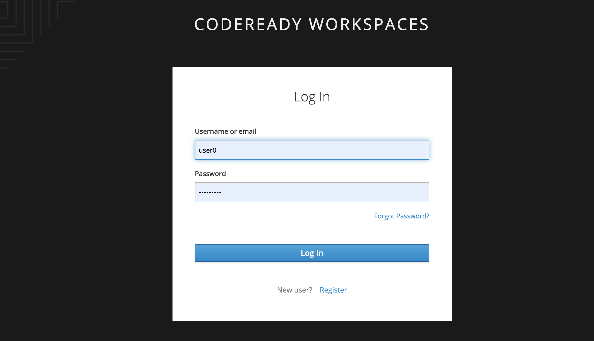

Once you log in, you'll be placed on your personal dashboard. We've pre-created workspaces for you to use. Click on the name of the pre-created workspace on the left, as shown below (the name will be different depending on your assigned number). You can also click on the name of the workspace in the center, and then click on the green button that says "OPEN" on the top right hand side of the screen:

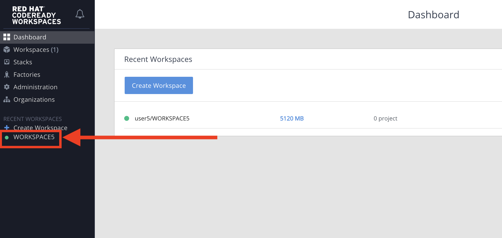

After a minute or two, you'll be placed in the workspace:

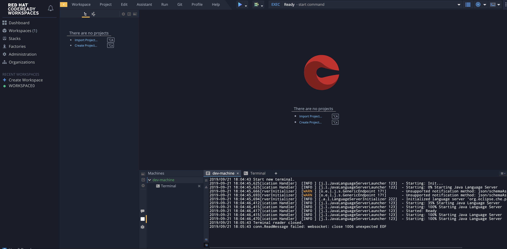

> **NOTE**:
>
> You may see random errors about websocket connections, plugins failing to load or other errors in the `dev-machine` window. You can ignore them as these are known issues that do not affect this workshop.

To gain extra screen space, click on the yellow arrow to hide the left menu (you won't need it):

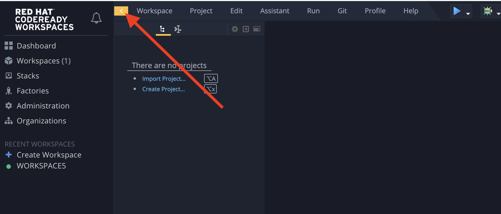

Users of Eclipse, IntelliJ IDEA or Visual Studio Code will see a familiar layout: a project/file browser on the left, a code editor on the right, and a terminal at the bottom. You'll use all of these during the course of this workshop, so keep this browser tab open throughout. **If things get weird, you can simply reload the browser tab to refresh the view.**

In the project explorer pane, click on the `Import Projects...` and enter the following:

  * Version Control System: `GIT`
  * URL: `{{GIT_URL}}/userXX/cloud-native-workshop-v2m1-labs.git`(IMPORTANT: replace userXX with your lab user)
  * Check `Import recursively (for multi-module projects)`
  * Name: `cloud-native-workshop-v2m1-labs`

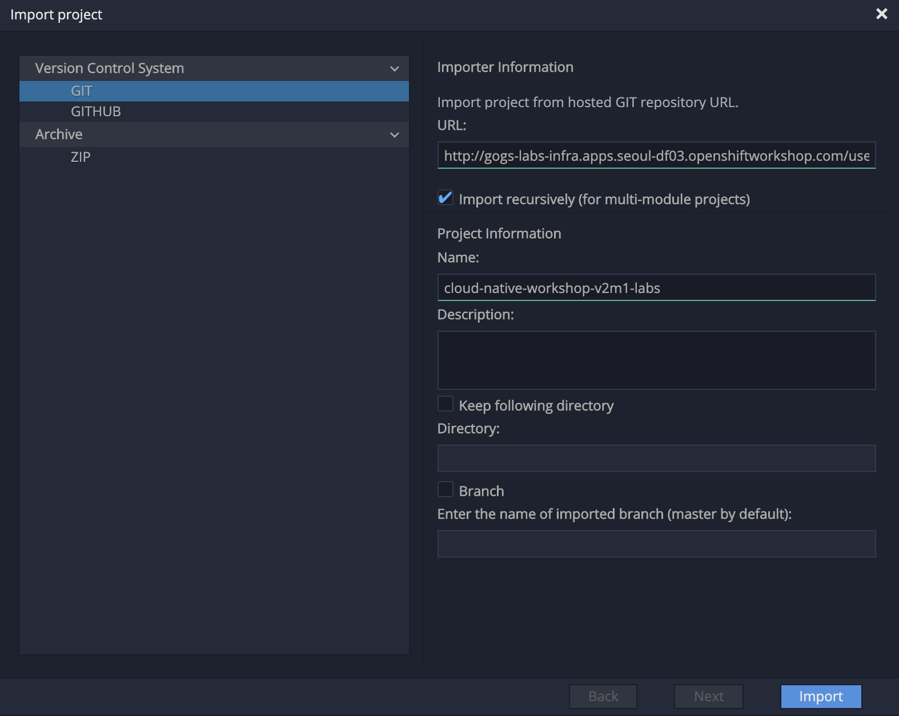{:width="700px"}

At the next screen, leave the project type set to `Blank` and click **Save**.

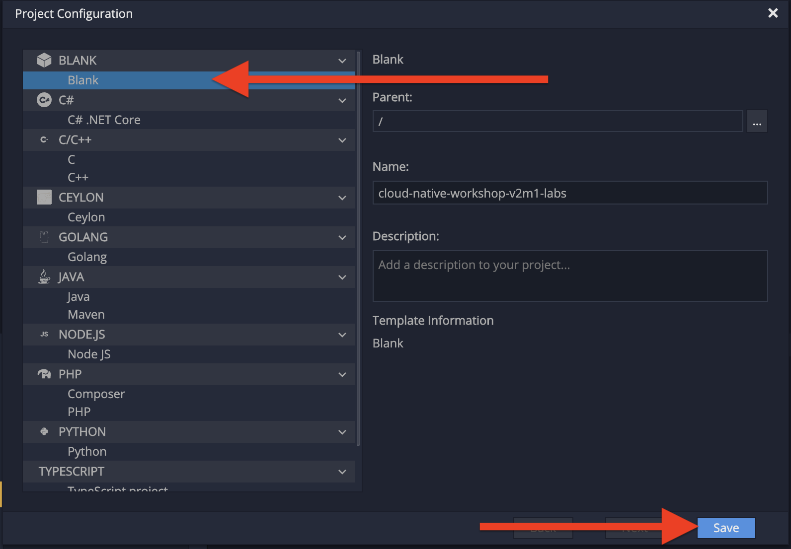{:width="700px"}

The project is imported into your workspace and is visible in the project explorer.

### Convert Projects

Expand the top-level project and look carefully at the icons next to each of the `monolith`, `catalog` and `inventory` directories. **Do you see a blue Maven icon as shown below?**

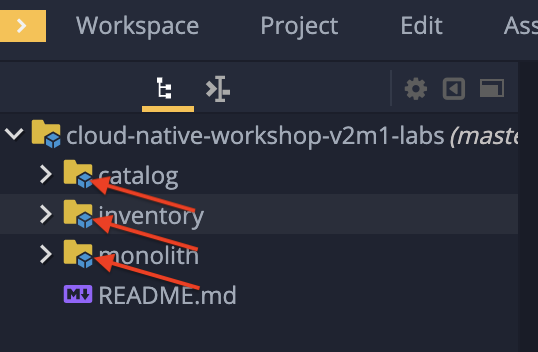{:width="900px"}

If you do **not** see these icons, then you'll need to right-click on each of the projects, and select "Convert to Project" and convert them to the _Maven_ type project as shown below:

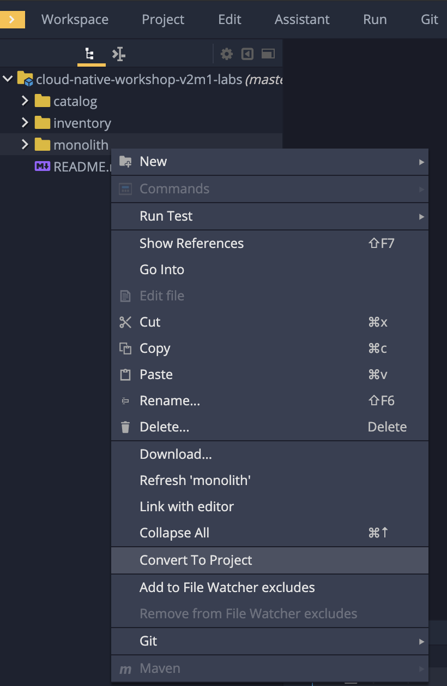{:width="500px"}

Choose **Maven** from the project configurations and then click on **Save**.

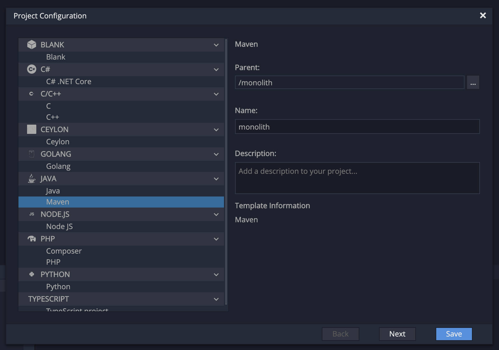{:width="700px"}

Be sure to do this for each of the `monolith`, `inventory` and `catalog` projects.

> `NOTE`: the Terminal window in CodeReady Workspaces. For the rest of these labs, anytime you need to run a command in a terminal, you can use the CodeReady Workspaces Terminal window.

####2. Review the issue related to `ApplicationLifecycleListener`

---

Open the Issues report in the [MTA Console]({{ MTA_URL }}){:target="_blank"}:

MTA provides helpful links to understand the issue deeper and offer guidance for the migration.

The WebLogic `ApplicationLifecycleListener` abstract class is used to perform functions or schedule jobs at Oracle WebLogic Server start and stop. In this case we have
code in the `postStart` and `preStop` methods which are executed after Weblogic starts up and before it shuts down, respectively.

In JBoss Enterprise Application Platform, there is no equivalent to intercept these events, but you can get equivalent functionality using a _Singleton EJB_ with standard annotations,
as suggested in the issue in the MTA report.

We will use the `@Startup` annotation to tell the container to initialize the singleton session
bean at application start. We will similarly use the `@PostConstruct` and `@PreDestroy` annotations to specify the
methods to invoke at the start and end of the application lifecyle achieving the same result but without
using proprietary interfaces.

While the code in our startup and shutdown is very simple, in the real world this code may require additional thought as part of the migration. However,
using this method makes the code much more portable.

####3. Fix the ApplicationLifecycleListener issues

---

To begin we are fixing the issues under the Monolith application. Navigate to this folder in the project tree navigation pane to the left side, and edit the source files under there.

Open the file `src/main/java/com/redhat/coolstore/utils/StartupListener.java`. Navigate the folder tree and double-click the source file to open it in the editing panel.

The first issue we will tackle is the one reporting the use of _Weblogic ApplicationLifecyleEvent_ and _Weblogic LifecycleListener_ in this file. Open the file to make these changes in the file. Replace the file so it is as follows:

~~~java
package com.redhat.coolstore.utils;

import javax.annotation.PostConstruct;
import javax.annotation.PreDestroy;
import javax.ejb.Startup;
import javax.inject.Singleton;
import javax.inject.Inject;
import java.util.logging.Logger;

@Singleton
@Startup
public class StartupListener {

    @Inject
    Logger log;

    @PostConstruct
    public void postStart() {
        log.info("AppListener(postStart)");
    }

    @PreDestroy
    public void preStop() {
        log.info("AppListener(preStop)");
    }

}
~~~

`Tip`: Where is the SAVE button?  CodeReady workspaces will autosave your changes, that is why you can’t find a SAVE button - no more losing code because you forgot to save. You can undo with `CTRL+Z` (`CMD-Z` on Mac) or by using the `Edit -> Undo` menu option.

####4. Test the build

---

Go to `Commands Palette` and dobule-click on `build` in CodeReady Workspaces:

If it builds successfully (you will see `BUILD SUCCESS`), then let's move on to the next issue! If it does not compile,
verify you made all the changes correctly and try the build again.

In the next step, we will migrate some Weblogic-specific code in the app to use standard Java EE interfaces.

Some of our application makes use of Weblogic-specific logging methods, which offer features related to logging of
internationalized content, and client-server logging.

In this case we are using Weblogic's `NonCatalogLogger` which is a simplified logging framework that doesn't use
localized message catalogs (hence the term _NonCatalog_).

The WebLogic `NonCatalogLogger` is not supported on JBoss EAP (or any other Java EE platform), and should be migrated to a supported logging framework, such as the JDK Logger or JBoss Logging.

We will use the standard Java Logging framework, a much more portable framework. The framework also
[supports internationalization](https://docs.oracle.com/javase/8/docs/technotes/guides/logging/overview.html#a1.17){:target="_blank"} if needed.

####5. Make the changes

---

Navigate to the `Monolith Folder` and work on the source files under here.

Open the `src/main/java/com/redhat/coolstore/service/OrderServiceMDB.java` file and replace its contents with:

~~~java
package com.redhat.coolstore.service;

import javax.ejb.ActivationConfigProperty;
import javax.ejb.MessageDriven;
import javax.inject.Inject;
import javax.jms.JMSException;
import javax.jms.Message;
import javax.jms.MessageListener;
import javax.jms.TextMessage;

import com.redhat.coolstore.model.Order;
import com.redhat.coolstore.utils.Transformers;

import java.util.logging.Logger;

@MessageDriven(name = "OrderServiceMDB", activationConfig = {
	@ActivationConfigProperty(propertyName = "destinationLookup", propertyValue = "topic/orders"),
	@ActivationConfigProperty(propertyName = "destinationType", propertyValue = "javax.jms.Topic"),
	@ActivationConfigProperty(propertyName = "acknowledgeMode", propertyValue = "Auto-acknowledge")})
public class OrderServiceMDB implements MessageListener {

	@Inject
	OrderService orderService;

	@Inject
	CatalogService catalogService;

	private Logger log = Logger.getLogger(OrderServiceMDB.class.getName());

	@Override
	public void onMessage(Message rcvMessage) {
		TextMessage msg = null;
		try {
				if (rcvMessage instanceof TextMessage) {
						msg = (TextMessage) rcvMessage;
						String orderStr = msg.getBody(String.class);
						log.info("Received order: " + orderStr);
						Order order = Transformers.jsonToOrder(orderStr);
						log.info("Order object is " + order);
						orderService.save(order);
						order.getItemList().forEach(orderItem -> {
							catalogService.updateInventoryItems(orderItem.getProductId(), orderItem.getQuantity());
						});
				}
		} catch (JMSException e) {
			throw new RuntimeException(e);
		}
	}

}
~~~

That one was pretty easy.

####6. Test the build

---

Build and package the app using Maven to make sure you code still compiles via CodeReady Workspaces `BUILD` window:

If builds successfully (you will see `BUILD SUCCESS`), then let's move on to the next issue! If it does not compile,
verify you made all the changes correctly and try the build again.

In this final step we will again migrate some Weblogic-specific code in the app to use standard Java EE interfaces,
and one JBoss-specific interface.

Our application uses [JMS](https://en.wikipedia.org/wiki/Java_Message_Service){:target="_blank"}{:target="_blank"} to communicate. Each time an order is placed in the application, a JMS message is sent to
a JMS Topic, which is then consumed by listeners (subscribers) to that topic to process the order using [Message-driven beans](https://docs.oracle.com/javaee/6/tutorial/doc/gipko.html){:target="_blank"}{:target="_blank"}, a form
of Enterprise JavaBeans (EJBs) that allow Java EE applications to process messages asynchronously.

In this case, `InventoryNotificationMDB` is subscribed to and listening for messages from `ShoppingCartService`. When
an order comes through the `ShoppingCartService`, a message is placed on the JMS Topic. At that point, the `InventoryNotificationMDB`
receives a message and if the inventory service is below a pre-defined threshold, sends a message to the log indicating that
the supplier of the product needs to be notified.

Unfortunately this MDB was written a while ago and makes use of weblogic-proprietary interfaces to configure and operate the
MDB. MTA has flagged this and reported it using a number of issues.

JBoss EAP provides an even more efficient and declarative way
to configure and manage the lifecycle of MDBs. In this case, we can use annotations to provide the necessary initialization
and configuration logic and settings. We will use the
`@MessageDriven` and `@ActivationConfigProperty` annotations, along with the `MessageListener` interfaces to provide the
same functionality as from Weblogic.

Much of Weblogic's interfaces for EJB components like MDBs reside in Weblogic descriptor XML files. Open
``src/main/webapp/WEB-INF/weblogic-ejb-jar.xml`` to see one of these descriptors. There are many different configuration
possibilities for EJBs and MDBs in this file, but luckily our application only uses one of them, namely it configures
`<trans-timeout-seconds>` to 30, which means that if a given transaction within an MDB operation takes too
long to complete (over 30 seconds), then the transaction is rolled back and exceptions are thrown. This interface is
Weblogic-specific so we'll need to find an equivalent in JBoss.

> You should be aware that this type of migration is more involved than the previous steps, and in real world applications
it will rarely be as simple as changing one line at a time for a migration. Consult the [MTA documentation](https://access.redhat.com/documentation/en/red-hat-application-migration-toolkit){:target="_blank"} for more detail on Red Hat's
Application Migration strategies or contact your local Red Hat representative to learn more about how Red Hat can help you
on your migration path.

####7. Review the issues

---

From the MTA Issues report, we will fix the remaining issues:

* `Call of JNDI lookup` - Our apps use a weblogic-specific [JNDI](https://en.wikipedia.org/wiki/Java_Naming_and_Directory_Interface){:target="_blank"} lookup scheme.
* `Proprietary InitialContext initialization` - Weblogic has a very different lookup mechanism for InitialContext objects
* `WebLogic InitialContextFactory` - This is related to the above, essentially a Weblogic proprietary mechanism
* `WebLogic T3 JNDI binding` - The way EJBs communicate in Weblogic is over T2, a proprietary implementation of Weblogic.

All of the above interfaces have equivalents in JBoss, however they are greatly simplified and overkill for our application which uses
JBoss EAP's internal message queue implementation provided by [Apache ActiveMQ Artemis](https://activemq.apache.org/artemis/){:target="_blank"}.

####8. Remove the weblogic EJB Descriptors

---

The first step is to remove the unneeded `weblogic-ejb-jar.xml` file. This file is proprietary to Weblogic and not recognized or processed by JBoss
EAP. Delete the file on Eclipse Navigator:

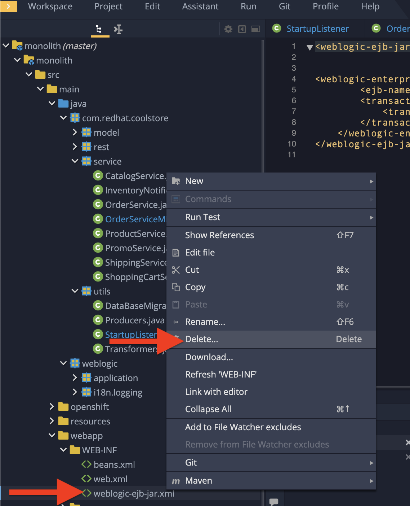{:width="500px"}

While we're at it, let's remove the `stub weblogic implementation classes` added as part of the scenario.

Right-click on the `weblogic` folder and select **Delete** to delete the folder:

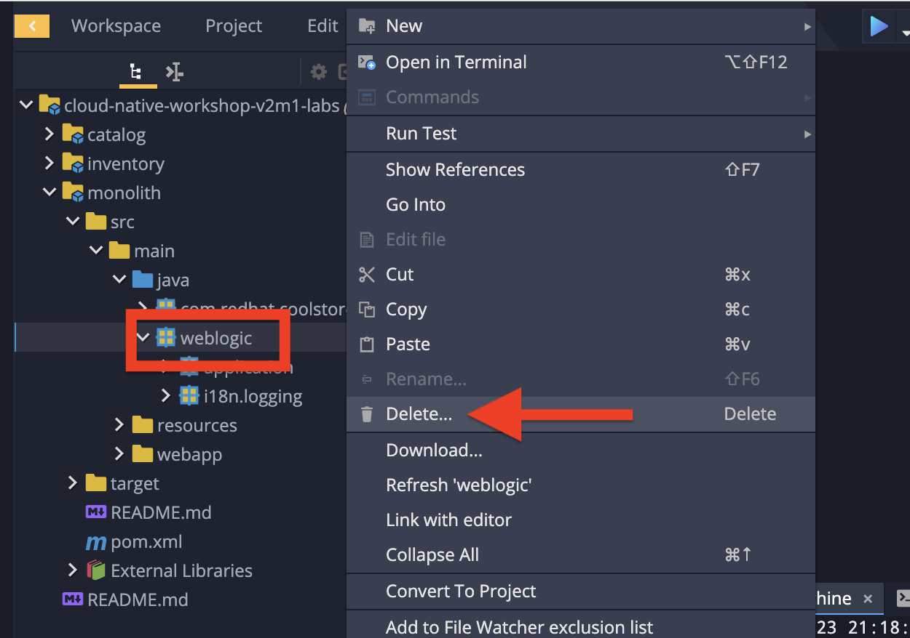{:width="500px"}

####9. Fix the code

---

Open the `src/main/java/com/redhat/coolstore/service/InventoryNotificationMDB.java` file and replace its contents with:

~~~java
package com.redhat.coolstore.service;

import com.redhat.coolstore.model.Order;
import com.redhat.coolstore.utils.Transformers;

import javax.ejb.ActivationConfigProperty;
import javax.ejb.MessageDriven;
import javax.inject.Inject;
import javax.jms.JMSException;
import javax.jms.Message;
import javax.jms.MessageListener;
import javax.jms.TextMessage;
import java.util.logging.Logger;

@MessageDriven(name = "InventoryNotificationMDB", activationConfig = {
        @ActivationConfigProperty(propertyName = "destinationLookup", propertyValue = "topic/orders"),
        @ActivationConfigProperty(propertyName = "destinationType", propertyValue = "javax.jms.Topic"),
        @ActivationConfigProperty(propertyName = "transactionTimeout", propertyValue = "30"),
        @ActivationConfigProperty(propertyName = "acknowledgeMode", propertyValue = "Auto-acknowledge")})
public class InventoryNotificationMDB implements MessageListener {

    private static final int LOW_THRESHOLD = 50;

    @Inject
    private CatalogService catalogService;

    @Inject
    private Logger log;

    public void onMessage(Message rcvMessage) {
        TextMessage msg;
        {
            try {
                if (rcvMessage instanceof TextMessage) {
                    msg = (TextMessage) rcvMessage;
                    String orderStr = msg.getBody(String.class);
                    Order order = Transformers.jsonToOrder(orderStr);
                    order.getItemList().forEach(orderItem -> {
                        int old_quantity = catalogService.getCatalogItemById(orderItem.getProductId()).getInventory().getQuantity();
                        int new_quantity = old_quantity - orderItem.getQuantity();
                        if (new_quantity < LOW_THRESHOLD) {
                            log.warning("Inventory for item " + orderItem.getProductId() + " is below threshold (" + LOW_THRESHOLD + "), contact supplier!");
                        }
                    });
                }

            } catch (JMSException jmse) {
                System.err.println("An exception occurred: " + jmse.getMessage());
            }
        }
    }
}
~~~

Remember the `<trans-timeout-seconds>` setting from the `weblogic-ejb-jar.xml` file? This is now set as an
`@ActivationConfigProperty` in the new code. There are pros and cons to using annotations vs. XML descriptors and care should be
taken to consider the needs of the application.

Your MDB should now be properly migrated to JBoss EAP.

####10. Test the build

---

Build and package the app using Maven to make sure you code still compiles via CodeReady Workspaces `BUILD` window:

If builds successfully (you will see `BUILD SUCCESS`), then let's move on to the next issue! If it does not compile,
verify you made all the changes correctly and try the build again.

####11. Re-run the MTA report

---

In this step we will re-run the MTA report to verify our migration was successful.

In the [MTA Console]({{ MTA_URL }}){:target="_blank"}, navigate to `Applications` on the left menu and click on `Add`. Enter the path to the fixed project at `/opt/solution` and click **Upload** to add the project:

Be sure to delete the old `monolith.war` to avoid analyzing it again:

and then click **Save and Run** to analyze the project:

Depending on how many other students are running reports, your analysis might be _queued_ for several minutes. If it is taking too long, feel free to skip the next section and proceed to step **13** and return back to the analysis later to confirm that you eliminated all the issues.

####12. View the results

---

Click on the lastet result to go to the report web page and verify that it now reports 0 Story Points:

You have successfully migrated
this app to JBoss EAP, congratulations!

Now that we've migrated the app, let's deploy it and test it out and start to explore some of the features that JBoss EAP
plus Red Hat OpenShift bring to the table.

####13. Add an OpenShift profile

---

Open the `pom.xml` file.

At the `<!-- TODO: Add OpenShift profile here -->` we are going to add a the following configuration to the pom.xml

~~~xml
        <profile>
          <id>openshift</id>
          <build>
              <plugins>
                  <plugin>
                      <artifactId>maven-war-plugin</artifactId>
                      <version>2.6</version>
                      <configuration>
                          <webResources>
                              <resource>
                                  <directory>${basedir}/src/main/webapp/WEB-INF</directory>
                                  <filtering>true</filtering>
                                  <targetPath>WEB-INF</targetPath>
                              </resource>
                          </webResources>
                          <outputDirectory>deployments</outputDirectory>
                          <warName>ROOT</warName>
                      </configuration>
                  </plugin>
              </plugins>
          </build>
        </profile>
~~~

####14. Create the OpenShift project

---

First, open a new brower with the [OpenShift web console]({{ CONSOLE_URL}}){:target="_blank"}

Login using:

* Username: `userXX`
* Password: `r3dh4t1!`

> **NOTE**: Use of self-signed certificates
>
> When you access the OpenShift web console]({{ CONSOLE_URL}}) or other URLs via _HTTPS_ protocol, you will see browser warnings
> like `Your > Connection is not secure` since this workshop uses self-signed certificates (which you should not do in production!).
> For example, if you're using **Chrome**, you will see the following screen.
>
> Click on `Advanced` then, you can access the HTTPS page when you click on `Proceed to...`!!!
>
> 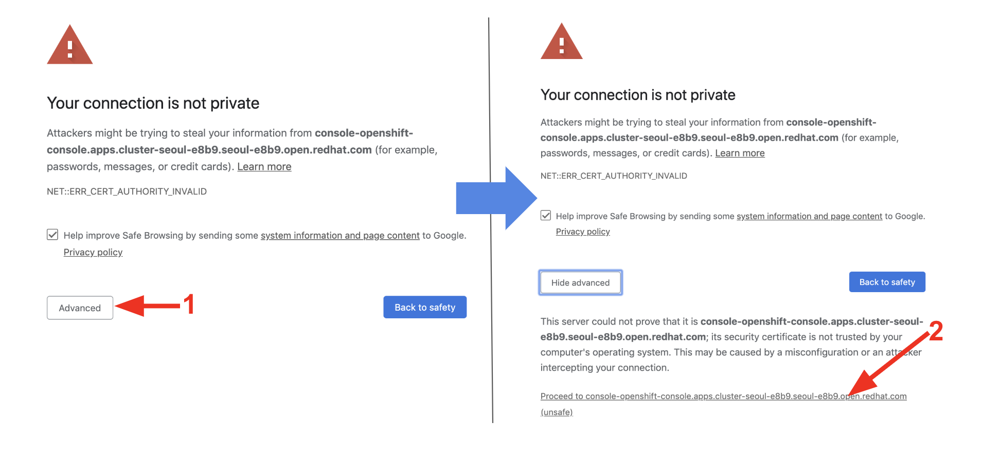
>
> Other browsers have similar procedures to accept the security exception.

You will see the OpenShift landing page:

> The project displayed in the landing page depends on which labs you will run today. If you will develop `Service Mesh and Identity` then you will see pre-created projects as the above screeenshot.

Click `Create Project`, fill in the fields, and click `Create`:

* Name: `userXX-coolstore-dev`
* Display Name: `USERXX Coolstore Monolith - Dev`
* Description: _leave this field empty_

> NOTE: YOU `MUST` USE `userXX-coolstore-dev` AS THE PROJECT NAME, as this name is referenced later on and you will experience failures if you do not name it `userXX-coolstore-dev`!

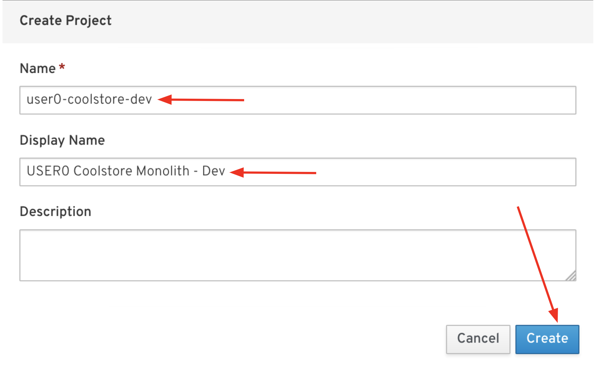{:width="700px"}

This will take you to the project status. There's nothing there yet, but that's about to change.

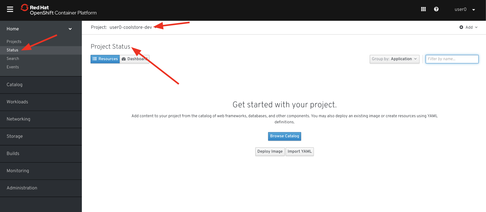

####15. Deploy the monolith

---

Although your Eclipse Che workspace is running on the Kubernetes cluster, it's running with a default restricted _Service Account_ that prevents you from creating most resource types. If you've completed other modules, you're probably already logged in, but let's login again: open a Terminal and issue the following command:

`oc login https://$KUBERNETES_SERVICE_HOST:$KUBERNETES_SERVICE_PORT --insecure-skip-tls-verify=true`

Enter your username and password assigned to you:

* Username: `userXX`
* Password: `r3dh4t1!`

You should see like:

~~~shell
Login successful.

You have access to the following projects and can switch between them with 'oc project <projectname>':

  * default
    istio-system
    user0-bookinfo
    user0-catalog
    user0-cloudnative-pipeline
    user0-cloudnativeapps
    user0-inventory

Using project "default".
Welcome! See 'oc help' to get started.
~~~

Switch to the developer project you created earlier via CodeReady Workspaces Terminal window:

`oc project userXX-coolstore-dev`

And finally deploy template:

`oc new-app coolstore-monolith-binary-build`

This will deploy both a PostgreSQL database and JBoss EAP, but it will not start a build for our application.

Then open up the `userXX-coolstore-dev` project status page at [OpenShift web console]({{ CONSOLE_URL}}){:target="_blank"}

and verify the monolith template items are created:

You can see the components being deployed on the
Project Status, but notice the `No running pod for Coolstore`. When you click on `coolstore DC`(Deployment Configs), you will see overview and resources.

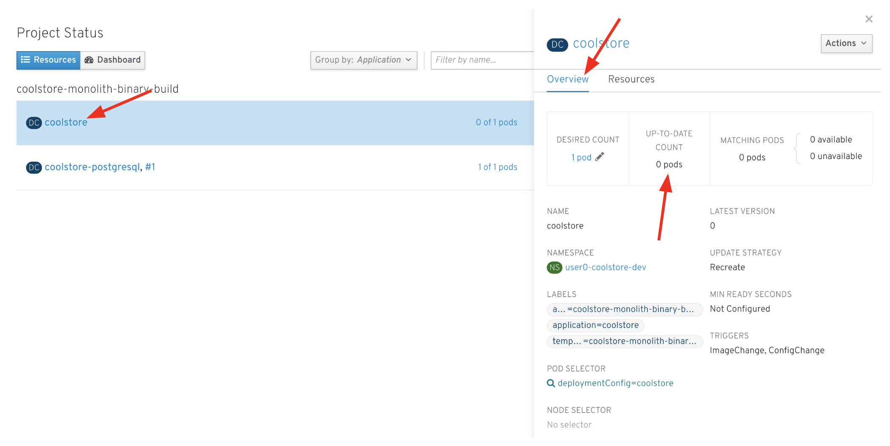

You have not yet deployed the container image built in previous steps, but you'll do that next.

####16. Deploy application using Binary build

---

In this development project we have selected to use a process called _binary builds_, which
means that instead of pointing to a public Git Repository and have the S2I (Source-to-Image) build process
download, build, and then create a container image for us we are going to build locally
and just upload the artifact (e.g. the `.war` file). The binary deployment will speed up
the build process significantly.

First, build the project once more using the `openshift` Maven profile, which will create a
suitable binary for use with OpenShift (this is not a container image yet, but just the `.war`
file). We will do this with the `oc` command line.

Build the project via CodeReady Workspaces Terminal window:

`cd /projects/cloud-native-workshop-v2m1-labs/monolith/`

`mvn clean package -Popenshift`

> `NOTE`: Make sure to run this mvn command at working directory(i.e monolith).

Wait for the build to finish and the `BUILD SUCCESS` message!

And finally, start the build process that will take the `.war` file and combine it with JBoss
EAP and produce a Linux container image which will be automatically deployed into the project,
thanks to the *DeploymentConfig* object created from the template:

`oc start-build coolstore --from-file=deployments/ROOT.war `

When you navigate `Builds` menu, you will find out `coolstore-xx` is `running` in Status field:

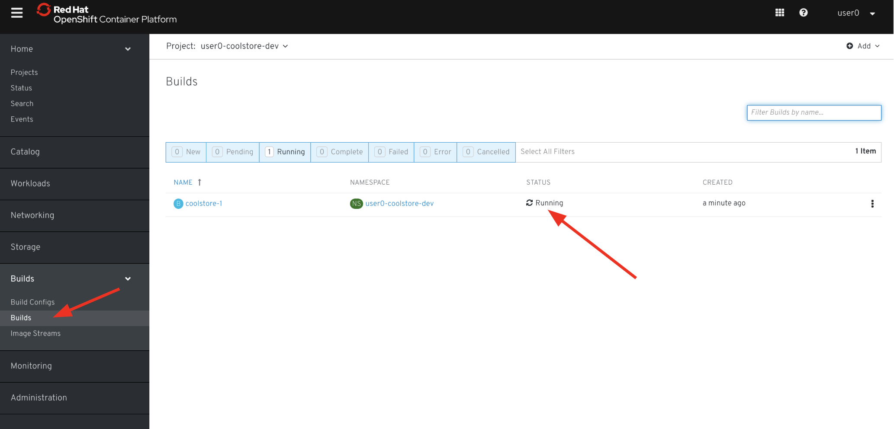

Wait for the build and deploy to complete:

`oc rollout status -w dc/coolstore`

This command will be used often to wait for deployments to complete. Be sure it returns success when you use it!
You should eventually see `replication controller "coolstore-1" successfully rolled out`.

> If the above command reports `Error from server (ServerTimeout)` then simply re-run the command until it reports success!

When it's done you should see the application deployed successfully.

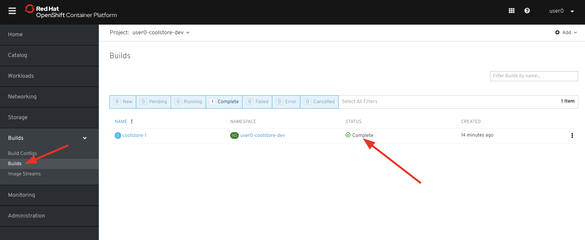

Test the application by clicking on the Route link at `Networking > Routes` on the left menu:

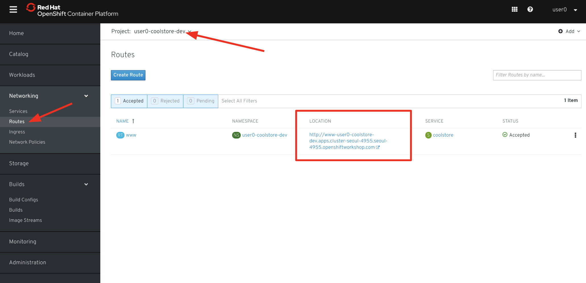

#####Congratulations!

Now you are using the same application that we built locally on OpenShift. That wasn't too hard right?

In the next step you'll explore more of the developer features of OpenShift in preparation for moving the
monolith to a microservices architecture later on. Let's go!

#### Summary

---

Now that you have migrating an existing Java EE app to the cloud
with JBoss and OpenShift, you are ready to start modernizing the
application by breaking the monolith into smaller microservices in
incremental steps, and employing modern techniques to ensure the
application runs well in a distributed and containerized environment.
